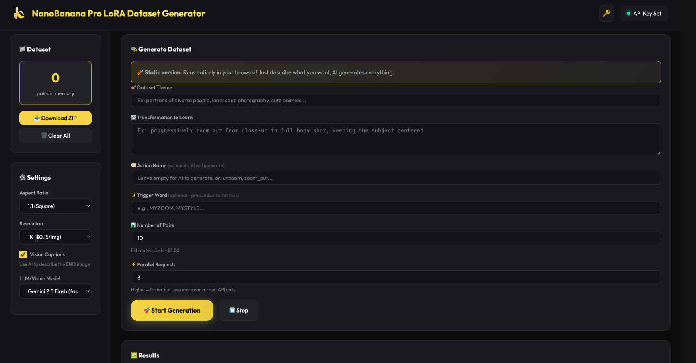

# 🏭 LoRAFactory - Multi-Provider Dataset Generator

> **Create training datasets for image editing models with ANY AI provider!**
> 
> Enhanced fork of [NanoBanana LoRA Dataset Generator](https://github.com/lovisdotio/NanoBananaLoraDatasetGenerator) by Lovis.io with **multi-provider architecture** supporting FAL.ai, OpenAI, Replicate, and more.



## ✨ What's New in LoRAFactory

**10 major enhancements over the original**:

- **🔌 Multi-Provider Support** - Extensible architecture for FAL.ai, OpenAI, Replicate, and more
- **🔐 AES-256 Encryption** - Military-grade API key encryption with password protection
- **💰 Live Pricing** - Real-time model pricing fetched from FAL.ai API
- **📦 Reference Image in ZIP** - Uploaded reference automatically included in dataset
- **📋 Collapsible Prompts** - Grid view with expandable prompts and copy-to-clipboard
- **🎨 Enhanced Model Selection** - Dynamic model discovery with pricing and compatibility checks
- **⚙️ Security Settings** - Session-only storage, auto-clear timer, encryption options
- **🎛️ Dynamic Model Parameters** - Schema-driven UI that adapts to each model's requirements automatically
- **💾 Custom Prompt Management** - Save, load, export, and import custom system prompts with persistence
- **💬 Chat Interface + API Stream** - Dedicated chat page for prompt-to-image / reference image editing with a live provider call log

**All original features** (3 modes, vision captions, parallel generation, etc.) from [NanoBanana](https://github.com/lovisdotio/NanoBananaLoraDatasetGenerator) by Lovis.io are preserved.

## 🔗 Links

- **💻 Source Code**: [github.com/cbl789/LoRAFactory-DatasetGenerator](https://github.com/cbl789/LoRAFactory-DatasetGenerator)
- **🍌 Original Project**: [NanoBanana by Lovis.io](https://github.com/lovisdotio/NanoBananaLoraDatasetGenerator)

---

## ✨ Features

- **3 Generation Modes**:
  - 🔄 **Pair Mode** - START → END transformation pairs for image editing LoRAs
  - 🖼️ **Single Image** - Style/aesthetic images for Z-Image and style LoRAs
  - 📷 **Reference Image** - Upload a character/product and generate variations
- **🎨 Multiple Image Models** - Choose from Nano Banana Pro, Flux 2 Flex, Seedream, Flux Dev/Schnell, Aura Flow, Recraft
- **🎛️ Dynamic Model Parameters** - UI automatically adapts to each model's parameters (image size, aspect ratio, etc.)
- **🧠 Custom System Prompt** - Full control over AI prompt generation with save/load/export/import
- **💰 Transparent Pricing** - See costs per model before generating
- **Zero server setup** - Runs entirely in your browser
- **Direct API calls** - Talks to AI providers directly
- **Parallel generation** - Generate multiple images simultaneously
- **ZIP download** - Download your complete dataset as a ZIP file
- **Vision captions** - AI-powered image descriptions with multiple LLM options
- **Trigger word support** - Add custom prefixes to your training data
- **🔐 Security Features** - API key encryption, session-only storage, auto-clear timer
- **💬 Chat Interface** - Chat-style prompt-to-image and reference-image editing page with a live API stream for debugging (supports drag/drop images onto the chat panel and call IDs for request/response pairing)

## 🎯 Generation Modes

### 🔄 Pair Mode (Default)
Generate START → END image pairs for training image editing models.
- Define a transformation (e.g., "zoom out", "add background", "change lighting")
- AI generates creative base prompts + edit instructions
- Perfect for: Flux 2, Qwen Image Edit, instruction-based models

### 🖼️ Single Image Mode
Generate single images with captions for style/aesthetic LoRAs.
- No before/after - just beautiful images with detailed captions
- Perfect for: Z-Image, style transfer, aesthetic LoRAs

### 📷 Reference Image Mode
Upload a reference image and generate variations.
- Upload a character, product, or style reference
- AI creates diverse variations while maintaining consistency
- Perfect for: Character LoRAs, product photography, consistent style training

## 🚀 Quick Start

### Option 1: One-Click Start (Recommended)
```bash
./start.sh
```
Automatically starts server and opens browser! Press Ctrl+C to stop.

The chat page is available at `chat.html` (or via the 💬 button in the main header).

To stop the server manually:
```bash
./stop.sh
```

### Option 2: Local (Double-click)
Simply open `index.html` in your browser!

> ⚠️ Some browsers block local file API calls. If it doesn't work, use Option 1.

### Option 3: Manual Server
```bash
python -m http.server 3000
# Open http://localhost:3000
```

Or with Node.js:
```bash
npx serve .
```

## 📁 Files

```
├── index.html         # Main page
├── chat.html          # Chat interface
├── app.js             # Application logic
├── chat.js            # Chat page logic
├── api_providers.js   # Provider abstraction layer (NEW!)
├── style.css          # Styling
└── README.md          # This file
```

## 🔑 API Keys

1. Click the 🔑 button in the app
2. Select your provider (FAL.ai, Kie.ai, Wisdom Gate, or custom)
3. Enter your API key and save

**Get API Keys**:
- **FAL.ai**: [fal.ai/dashboard/keys](https://fal.ai/dashboard/keys)
- **Kie.ai**: [kie.ai](https://kie.ai) - 19% cheaper than official Seedream pricing
- **Wisdom Gate**: [wisdom-gate.juheapi.com](https://wisdom-gate.juheapi.com) - OpenAI-compatible API with Gemini 3 Pro Image
- **Custom**: Add any REST API provider via UI

**Security**: Your keys are stored ONLY in your browser's localStorage. They're never sent anywhere except directly to the selected provider's servers.

## 🎛️ Dynamic Model Parameters

LoRAFactory automatically fetches each model's parameter schema from FAL.ai and generates a custom UI:
- **Preset/Custom toggles** for image size (e.g., Seedream's preset sizes vs custom dimensions)
- **Model-specific controls** that adapt when you switch models
- **Basic/Advanced sections** for organized parameter display
- **Automatic validation** based on model requirements

Parameters are cached locally for fast switching between models.

## 💾 Custom System Prompt Management

Save and manage multiple custom system prompts:
- **Save prompts** with custom names for each generation mode
- **Load saved prompts** from a dropdown list
- **Export/Import** prompts as JSON files for backup and sharing
- **Persistent storage** in browser localStorage (survives browser restarts)
- **Mode-specific** prompts automatically filtered by current generation mode

## 💰 Pricing

### FAL.ai
| Resolution | Cost per image |
|------------|----------------|
| 1K | $0.15 |
| 2K | $0.15 |
| 4K | $0.30 |

Vision captions: ~$0.002 per image

**Examples**:
- Pair Mode: 20 pairs × 2 images × $0.15 = ~$6.00
- Single/Reference Mode: 20 images × $0.15 = ~$3.00

### Kie.ai (Seedream 4.5)
| Quality | Cost per image |
|---------|----------------|
| Basic (2K) | 6.5 credits ≈ $0.032 |
| High (4K) | 6.5 credits ≈ $0.032 |

**Examples**:
- Pair Mode: 20 pairs × 2 images × $0.032 = ~$1.28
- Single/Reference Mode: 20 images × $0.032 = ~$0.64

**Note**: Kie.ai is ~80% cheaper than FAL.ai! LLM/Vision features still require FAL.ai.

### Wisdom Gate (Gemini 3 Pro Image)
| Resolution | Cost per image |
|------------|----------------|
| 1K | ~$0.10 |
| 2K | ~$0.13 |
| 4K | ~$0.24 |

**Examples**:
- Pair Mode: 20 pairs × 2 images × $0.13 = ~$5.20
- Single/Reference Mode: 20 images × $0.13 = ~$2.60

**Note**: Wisdom Gate supports full LLM and vision capabilities. ~33% cheaper than FAL.ai for 2K images.

## 📦 Output Format

### Pair Mode
```
lorafactory_dataset_TIMESTAMP.zip
├── 0001_start.png    # Starting image
├── 0001_end.png      # Transformed image
├── 0001.txt          # Action description / caption
├── 0002_start.png
├── 0002_end.png
├── 0002.txt
└── ...
```

### Single / Reference Mode
```
lorafactory_dataset_TIMESTAMP.zip
├── 0001.png          # Generated image
├── 0001.txt          # Caption
├── 0002.png
├── 0002.txt
└── ...
```

Compatible with:
- **Flux 2** - LoRA fine-tuning
- **Z-Image** - Style/aesthetic training
- **Qwen Image Edit** - Instruction-based editing
- **SDXL** - Fine-tuning and LoRA
- **Any image-to-image model** - Universal format

## 🔧 Adding New Providers

LoRAFactory's modular architecture makes it easy to add new providers:

1. Create a new provider class in `api_providers.js`:
```javascript
export class OpenAIProvider extends ApiProvider {
    // Implement required methods
}
```

2. Register it in the `ProviderManager`
3. Add the option to the HTML dropdown

See `api_providers.js` for the `FalProvider` reference implementation.

## 🐛 Troubleshooting

### "Failed to fetch" errors
- Check your API key is valid
- Check you have credits with your provider
- Try reducing parallel requests to 1

### CORS errors when opening locally
Use a local server instead of double-clicking:
```bash
python -m http.server 3000
```

### Generation is slow
- Increase parallel requests (up to 5-10)
- Use 1K resolution instead of 4K
- Disable vision captions for faster generation

## 📜 License

MIT - Use freely for any purpose.

## 🙏 Credits

- **Original Project**: [NanoBanana LoRA Dataset Generator](https://github.com/lovisdotio/NanoBananaLoraDatasetGenerator) by Lovis.io
- **FAL.ai** - GPU infrastructure and models
- **OpenRouter** - LLM routing for prompts and captions

---

Made with 🏭 for the AI art community
